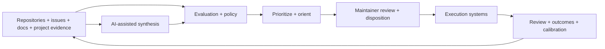
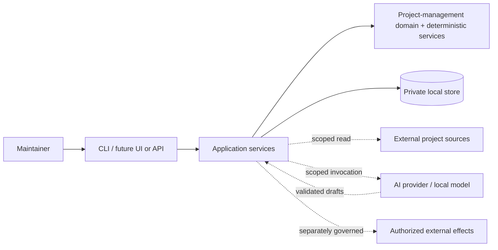
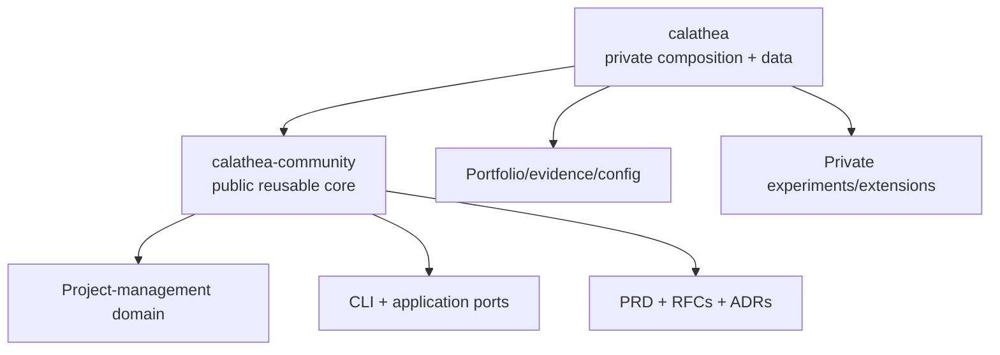

# Calathea

> AI-assisted project management for technical maintainers — local-first, explainable, and human-authoritative.

[](https://github.com/hackelia-micrantha/calathea-community/commits/main)
[](https://github.com/hackelia-micrantha/calathea-community/issues)
[](https://github.com/hackelia-micrantha/calathea-community/pulls)
[](LICENSE)

## Overview

Calathea is an **AI-assisted project-management system** for technical maintainers responsible for more projects and plausible work than available capacity permits.

It is intended to help answer the recurring management questions around a software portfolio:

- What should I work on now?
- What should come next?
- What can wait?
- What should I stop investing in?
- What changed since the last plan or review?
- Which assumptions, risks, or estimates are becoming stale?
- Why did a recommendation change, and what evidence supports it?

Calathea combines two deliberately different kinds of machinery:

1. **AI assistance** for evidence synthesis, draft evaluations, observations, findings, explanations, contradiction detection, and other high-context project-management work.
2. **Deterministic project semantics** for evaluation, policy, prioritization, lifecycle, review, history, and decision traces where reproducibility and authority matter.

The result is AI-assisted project management without making an AI model the system of record or the final decision-maker.

Calathea's initial v0 release is intentionally narrower than the full product direction: it first delivers local portfolio orientation into explainable `now`, `next`, `later`, and `kill` recommendations. Broader planning, review, feedback, lifecycle, evidence, and integration contracts are already represented in the product and RFC model and can build on that foundation.

A `kill` placement is a recommendation to stop investing. It is not an automatic lifecycle transition, deletion, archival action, or repository mutation.

## Product model

Calathea acts as the **decision and review layer** around existing engineering systems rather than trying to replace every execution tool.



Repositories, issue trackers, CI systems, and other project tools can remain authoritative for execution state. Calathea is authoritative for the project-management records it owns: evaluations, policy versions, orientation runs, dispositions, review findings, lifecycle decisions, outcomes, and their history.

## AI-assisted, not AI-authoritative

AI is a first-class assistance surface in the product, but it does not receive hidden authority.

AI may help with:

- summarizing scoped repository, issue, document, and project evidence;
- drafting evaluation rationale and candidate axis values;
- identifying missing, stale, or contradictory evidence;
- drafting observations, findings, and recommendations for review cycles;
- explaining prioritization and policy traces in useful human language;
- preparing structured project-management recommendations for maintainer review.

AI output is treated as **untrusted recommendation data**. Structured output is validated before it can influence a workflow, and canonical decisions still pass through explicit maintainer-authorized domain operations.

This separation is intentional:

```text
untrusted project evidence
        ↓
scoped AI assistance
        ↓
validated recommendation draft
        ↓
deterministic project semantics
        ↓
maintainer review / disposition
        ↓
canonical Calathea record
        ↓
separately authorized external effect, if any
```

The deterministic core remains usable without an AI provider or network connection. That is a resilience, privacy, testability, and replay property—not a statement that AI is peripheral to the product experience.

See [RFC 0004](docs/rfc_0004_ai_governance_paved_road_and_tooling_policy.md) for the AI interaction boundary and [RFC 0003](docs/rfc_0003_review_feedback_and_learning_semantics.md) for review, feedback, and calibration semantics.

## What Calathea manages

The product model covers several related project-management concerns:

### Portfolio prioritization

- structured evaluation of impact, effort, risk reduction, optionality, urgency, and confidence;
- deterministic scoring and policy-aware ranking;
- bounded `now` and `next` queues;
- explicit `later` and stop-investing recommendations;
- stable tie-breaking and complete decision traces.

### Planning and lifecycle

- explicit project identity and lifecycle state;
- versioned policy constraints and exceptions;
- immutable orientation runs and maintainer dispositions;
- history that can be compared and replayed rather than silently rewritten.

### Review and feedback

- scheduled, ad-hoc, and evidence-triggered review cycles;
- observations, findings, recommendations, and dispositions;
- drift detection across priority, execution, estimates, ownership, narrative, lifecycle, and evidence;
- outcome and calibration signals that feed later planning without silently changing heuristics.

### Evidence and integrations

- attributable references to repository and project evidence;
- optional read-only external signals;
- scoped AI context assembly with explicit outbound data boundaries;
- integration contracts that keep imported content as data rather than instruction;
- future effectful operations behind a separate authorization and approval boundary.

## Paved-road philosophy

Calathea should make the safe, inspectable path the easiest path:

- local-first by default;
- private project data outside source repositories by default;
- deterministic and replayable decision semantics;
- AI assistance through versioned, bounded, validated invocation contracts;
- read-only external integration before write-capable integration;
- explicit provenance for evidence and recommendations;
- explicit human disposition before canonical project-management decisions;
- explicit authorization before external effects;
- no mandatory hosted account, telemetry, or cloud persistence.

Where used, Invokrum can provide deterministic instruction composition and integrity for AI invocations. Where effectful integrations are later introduced, Anthesis can provide authorization, approval, capability, and effect-governance boundaries. Neither is required for the deterministic Calathea core.

## Public repository role

This repository is the canonical public home for reusable Calathea semantics and implementation.

Calathea uses a public-core/private-composition split:

- **`calathea-community`** owns reusable product contracts, deterministic implementation, public tooling, and supported integration boundaries;
- **`calathea`** retains private portfolio data/configuration, dogfood operations, and intentionally private extensions.

See [the repository boundary](docs/architecture/repository-boundary.md) for ownership rules and [ADR 0005](docs/adr/0005_public_go_process_boundary.md) for the Go/process boundary.

### Public core

`calathea-community` owns:

- deterministic domain, evaluation, policy, orientation, lifecycle, review, and trace semantics;
- generic application services and application-owned ports;
- the `calathea` CLI and reusable local persistence implementation as it is added;
- schemas, migrations, fixtures, golden tests, and conformance tests;
- the public [PRD](docs/product/prd.md), [use cases](docs/product/use-cases.md), and [MVP roadmap](docs/product/mvp-roadmap.md);
- [RFCs](docs/rfcs/README.md), [ADRs](docs/adr/README.md), and architecture contracts;
- public AI/integration contracts, including the Invokrum boundary;
- generic examples, documentation, CI, and development tooling.

### Private composition

The private `calathea` repository retains:

- real portfolio, evaluation, rationale, and evidence data;
- private policy calibration and experiments;
- private instruction/profile packs and model configuration;
- private integration/deployment configuration;
- dogfood and operational material;
- proprietary or experimental extensions not intentionally promoted to the public core.

Credentials and secret values belong in neither repository.

## Go and process boundary

The public module is:

```text
github.com/hackelia-micrantha/calathea-community
```

The executable remains named `calathea`.

The Go implementation stays under `internal/`; those package paths are not a supported external library API. For v0, cross-repository composition uses the executable plus explicitly versioned file/schema/CLI contracts. A future exported Go facade requires a concrete in-process consumer and a separate compatibility decision.

The supported process surface and its current stable anchors are defined in the [CLI and process compatibility contract](docs/architecture/cli-process-contract.md). Automation must not treat human-readable CLI prose or internal Go identifiers as machine contracts.

## Product boundary

Calathea is project management, but it is not intended to become an undifferentiated replacement for GitHub Issues, Jira, Linear, CI/CD, source control, or autonomous implementation agents.

Its reusable core is designed to remain:

- local-first and usable without network access;
- deterministic where canonical project semantics require reproducibility;
- human-approved rather than autonomously authoritative;
- read-only toward external repositories and project systems by default;
- independent of hosted accounts, mandatory telemetry, and cloud persistence;
- independent of Anthesis or another governance platform for core planning and orientation.

Future effectful integrations require an explicit authorization/approval boundary. Anthesis may be one such adapter, but its concepts do not belong in the deterministic Calathea core.

## System context



Private user data is intentionally separate from the public source repository.

## Repository split



The dependency direction is private-to-public. The public core must not require the private repository to build, test, or run its documented core workflow.

## Development

Go is pinned through `mise.toml`. The local quality gate is:

```text
mise run check
```

It verifies formatting, runs static analysis and tests, and builds the `calathea` executable. The broader CI contract adds the repository's pinned quality, security, fuzzing, and process-level checks.

## Current status

The public/private split, product contracts, RFC/ADR foundation, process boundary, and deterministic Go foundation are established.

The active MVP path is the UC-01 vertical slice:

1. deterministic policy and orientation engine;
2. local immutable persistence and rebuildable projections;
3. project/evaluation/policy setup and orientation/disposition CLI;
4. comparison, replay, recovery, backup/restore, and privacy behavior;
5. hardening, packaging, and private dogfood evidence.

Optional structured AI invocation is intentionally downstream of the deterministic MVP critical path, while the product architecture already defines how AI participates safely. This keeps the implementation sequence narrow without reducing Calathea's product identity to a scoring engine.

See the [MVP roadmap](docs/product/mvp-roadmap.md) and issue #11 for the current implementation sequence.

## Security and privacy

Public Calathea development must preserve these invariants:

- private portfolio data stays outside source checkouts by default;
- deterministic workflows can run with network access disabled;
- optional outbound integrations are explicit, scoped, and attributable;
- imported repository content is untrusted data, not executable instruction;
- AI output is validated recommendation data, not canonical authority;
- credentials are excluded from project records, prompts, evidence, traces, and model context;
- failures in optional integrations do not silently mutate canonical state;
- historical decisions remain attributable and are not silently rewritten;
- effectful external operations require a separate explicit authorization boundary.

## License

MPL-2.0. See [LICENSE](LICENSE).
