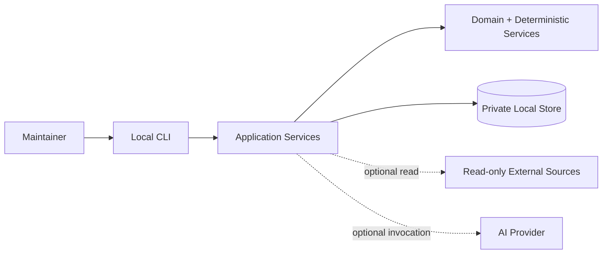
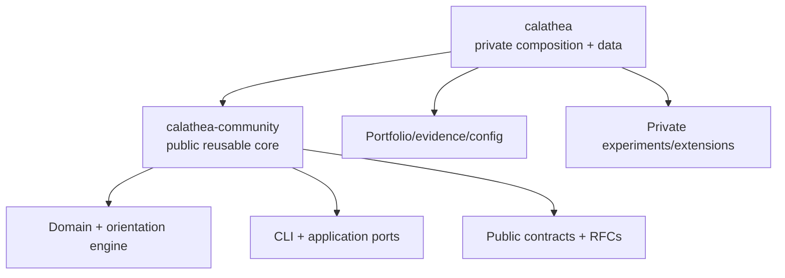

# Calathea

> Local-first portfolio orientation for governed human-and-AI planning.

[](https://github.com/hackelia-micrantha/calathea-community/commits/main)
[](https://github.com/hackelia-micrantha/calathea-community/issues)
[](https://github.com/hackelia-micrantha/calathea-community/pulls)
[](LICENSE)

## Overview

Calathea helps a technical maintainer decide what to work on now, what should come next, what can wait, and what should be stopped.

The product is deliberately local-first and human-authoritative. Its deterministic core converts explicit project evaluations and policy constraints into explainable `now`, `next`, `later`, and `kill` recommendations. AI assistance and external repository signals are optional extensions rather than prerequisites.

A `kill` placement is a recommendation to stop investing. It is not an automatic lifecycle transition, deletion, archival action, or repository mutation.

## Public repository role

This repository is the public home for reusable Calathea semantics and implementation.

Calathea is migrating from the private `hackelia-micrantha/calathea` repository into a clean public-core/private-composition split. The executable deterministic Go core is being promoted here under the coordinated migration tracked by #2 and private `calathea#48`. A source path becomes canonical here only when its private duplicate is removed or replaced as part of that migration slice.

See [the repository boundary](docs/architecture/repository-boundary.md) for ownership rules and [ADR 0001](docs/adr/0001_public_go_process_boundary.md) for the Go/process boundary.

### Public core

`calathea-community` owns or is intended to own:

- deterministic domain and orientation logic;
- generic application services and application-owned ports;
- the `calathea` CLI and reusable local persistence implementation;
- schemas, migrations, fixtures, golden tests, and conformance tests;
- reusable PRD/use cases, RFCs, ADRs, and architecture contracts;
- public contracts for optional integrations such as Invokrum;
- generic examples, documentation, CI, and development tooling.

### Private composition

The private `calathea` repository retains:

- real portfolio, evaluation, rationale, and evidence data;
- private policy calibration and experiments;
- private instruction/profile packs and model configuration;
- private integration/deployment configuration;
- dogfood and operational material;
- proprietary or experimental extensions not intentionally promoted to the public core.

Credentials and secret values belong in neither repository.

## Go boundary

The public module is:

```text
github.com/hackelia-micrantha/calathea-community
```

The executable remains named `calathea`.

The Go implementation stays under `internal/`; those package paths are not a supported external library API. For v0, cross-repository composition uses the executable plus explicitly versioned file/schema/CLI contracts. A future exported Go facade requires a concrete in-process consumer and a separate compatibility decision.

## Product boundary

Calathea's reusable core is designed to remain:

- local-first and usable without network access;
- deterministic without requiring AI;
- human-approved rather than autonomously authoritative;
- read-only toward external repositories and project systems by default;
- independent of hosted accounts, mandatory telemetry, and cloud persistence;
- independent of Anthesis or another governance platform for core orientation.

Future effectful integrations require an explicit authorization/approval boundary. Anthesis may be one such adapter, but its concepts do not belong in the deterministic Calathea core.

## System context



Private user data is intentionally separate from the public source repository.

## Repository split



The dependency direction is private-to-public. The public core must not require the private repository to build, test, or run its documented core workflow.

## Development

Go is pinned through `mise.toml`. The local quality gate is:

```text
mise run check
```

It verifies formatting, runs `go vet` and `go test ./...`, and builds the `calathea` executable. The core has no third-party Go module dependencies at this stage.

## Current migration status

- repository ownership and MPL-2.0 licensing are established;
- the Go module, CLI/application boundary, deterministic domain foundation, tests, and synthetic golden fixtures are staged in the public-core extraction;
- the process boundary deliberately avoids exporting a broad Go library API;
- reusable PRD/RFC/ADR/architecture migration remains tracked by #3;
- CLI/process compatibility hardening is tracked by #5;
- public-safety review of promoted source/fixtures is tracked by #6;
- the private companion cleanup is tracked by `calathea#48`.

## Security and privacy

Public Calathea development must preserve these invariants:

- private portfolio data stays outside source checkouts by default;
- deterministic workflows can run with network access disabled;
- optional outbound integrations are explicit and scoped;
- imported repository content is untrusted data, not executable instruction;
- credentials are excluded from project records, prompts, evidence, traces, and model context;
- failures in optional integrations do not silently mutate canonical state.

## License

MPL-2.0. See [LICENSE](LICENSE).
