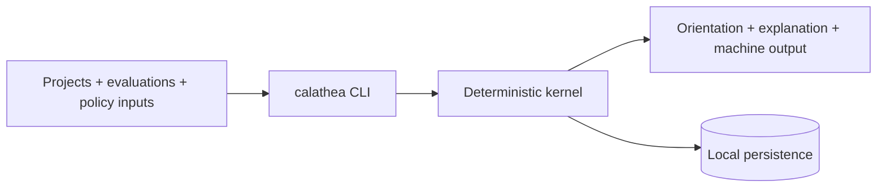
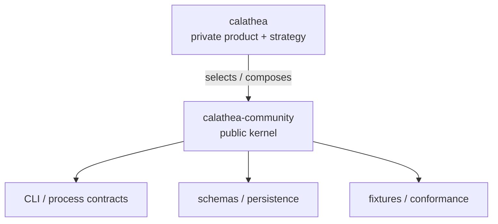

# Calathea Community

> Open-source deterministic kernel and compatibility surface for Calathea-style project orientation.

[](https://github.com/hackelia-micrantha/calathea-community/commits/main)
[](https://github.com/hackelia-micrantha/calathea-community/issues)
[](https://github.com/hackelia-micrantha/calathea-community/pulls)
[](LICENSE)

## What this repository is

`calathea-community` is the public reusable kernel consumed by the private Calathea product and usable independently by community users.

It provides deterministic mechanisms and stable integration surfaces for project-orientation workflows without publishing or owning the complete Calathea product strategy.

The kernel focuses on things independent consumers need to rely on:

- deterministic evaluation/orientation behavior;
- the `calathea` CLI and supported process contract;
- versioned file/schema interfaces;
- reusable local persistence, migrations, replay, and recovery behavior;
- fixtures, golden tests, and conformance tests;
- kernel-level privacy and safety invariants;
- generic extension/interoperability boundaries;
- packaging, CI, and contributor documentation.

## What this repository is not

This repository is **not** the canonical home of Calathea's complete:

- product PRD or strategic roadmap;
- end-to-end project-management use-case taxonomy;
- prioritization philosophy or deployment calibration;
- planning/review/lifecycle/milestone policy;
- AI paved-road, model-routing, or private prompt/profile strategy;
- dogfood conclusions or private portfolio data.

Those belong to the private `hackelia-micrantha/calathea` product repository.

The public kernel may implement capabilities required by that product, but implementation dependency does not transfer product/specification authority.

## Standalone model

A community user can use this repository without the private product repository.



The kernel is intentionally local-first. Deterministic workflows should remain usable without a hosted account, mandatory telemetry, AI provider, or network access.

## Public contract surface

The public module is:

```text
github.com/hackelia-micrantha/calathea-community
```

The executable remains:

```text
calathea
```

The Go implementation primarily remains under `internal/`; those paths are not a supported external library API.

For v0, supported composition uses:

- documented CLI behavior and exit semantics;
- machine-readable output where explicitly versioned;
- versioned file/schema contracts;
- documented persistence/migration contracts as introduced.

See [CLI/process compatibility](docs/architecture/cli-process-contract.md) and [repository boundary](docs/architecture/repository-boundary.md).

## Community-kernel scope

The current kernel supports the deterministic foundation needed to:

1. accept valid project/evaluation/policy inputs;
2. calculate reproducible evaluation/orientation results;
3. bound active/next queues and explain placement/exclusion;
4. retain versioned history and replayable state as persistence lands;
5. expose automation-safe process/file/schema contracts;
6. remain safe when optional integrations are disabled or fail.

See the deliberately narrow [community-kernel scope](docs/product/prd.md), [kernel use cases](docs/product/use-cases.md), and [kernel roadmap](docs/product/mvp-roadmap.md).

## Public/private boundary



The dependency direction is private-to-public. The public kernel must not require the private repository to build, test, package, or run its documented standalone workflows.

The publication rule is conservative:

> A concept belongs here when an independent community consumer or implementation must know it for compatibility, safety, contribution, or useful standalone operation.

Generic product strategy does not become a public contract merely because it could be reused.

## RFC and ADR policy

Public RFCs own durable **kernel behavior and compatibility**, not the complete Calathea product model.

Public ADRs own implementation decisions for this repository and its exposed surfaces.

RFC 0000–0008 were narrowed under issue #48 to kernel compatibility, safety, and extension contracts. Historical broader text remains available in git history; current-head documentation defines the minimum public contract.

See [RFC governance](docs/rfcs/README.md) and [ADR governance](docs/adr/README.md).

## Security and privacy invariants

Public kernel development must preserve:

- no credentials in project records, prompts, traces, evidence, or fixtures;
- private/user data outside source checkouts by default;
- deterministic workflows that can run with network access disabled;
- imported external content treated as untrusted data;
- optional outbound integrations explicit, scoped, and attributable;
- failed optional integrations not partially mutating canonical kernel state;
- versioned/replayable historical behavior where promised;
- effectful external operations outside the ambient authority of the kernel.

## Development

Go is pinned through `mise.toml`.

```text
mise run check
```

The local quality gate verifies formatting, static analysis, tests, and the `calathea` build. CI adds the repository's pinned quality, security, fuzzing, and process-level checks.

The boundary contraction is tracked in issue #48; the private product-side decision is `hackelia-micrantha/calathea#59`.

## License

MPL-2.0. See [LICENSE](LICENSE).
