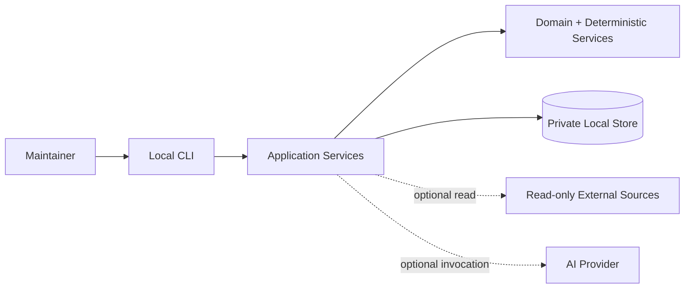
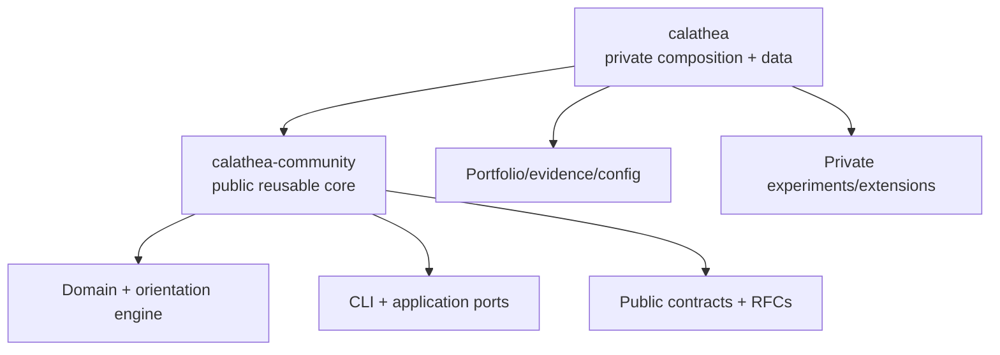

# Calathea

> Local-first portfolio orientation for governed human-and-AI planning.

## Overview

Calathea helps a technical maintainer decide what to work on now, what should come next, what can wait, and what should be stopped.

The product is deliberately local-first and human-authoritative. Its deterministic core converts explicit project evaluations and policy constraints into explainable `now`, `next`, `later`, and `kill` recommendations. AI assistance and external repository signals are optional extensions rather than prerequisites.

A `kill` placement is a recommendation to stop investing. It is not an automatic lifecycle transition, deletion, archival action, or repository mutation.

## Public repository role

This repository is the public home for reusable Calathea semantics and implementation.

The project is being migrated from the private `hackelia-micrantha/calathea` repository into a clean public/private split. During that transition, a source path becomes canonical here only when the corresponding migration slice removes or replaces the private duplicate. Equivalent source files are not intended to be maintained manually in both repositories.

See [the repository boundary](docs/architecture/repository-boundary.md) for the ownership and migration rules.

### Public core

`calathea-community` is intended to own:

- deterministic domain and orientation logic;
- generic application services and application-owned ports;
- the public CLI and reusable local persistence implementation;
- schemas, migrations, fixtures, golden tests, and conformance tests;
- reusable PRD/use cases, RFCs, ADRs, and architecture contracts;
- public contracts for optional integrations such as Invokrum;
- generic examples, documentation, CI, and development tooling.

### Private composition

The private `calathea` repository retains:

- real portfolio, evaluation, rationale, and evidence data;
- private policy calibration and experiments;
- private instruction/profile packs and model configuration;
- private integration/deployment configuration;
- dogfood and operational material;
- proprietary or experimental extensions not intentionally promoted to the public core.

Credentials and secret values belong in neither repository.

## Product boundary

Calathea's reusable core is designed to remain:

- local-first and usable without network access;
- deterministic without requiring AI;
- human-approved rather than autonomously authoritative;
- read-only toward external repositories and project systems by default;
- independent of hosted accounts, mandatory telemetry, and cloud persistence;
- independent of Anthesis or another governance platform for core orientation.

Future effectful integrations require an explicit authorization/approval boundary. Anthesis may be one such adapter, but its concepts do not belong in the deterministic Calathea core.

## System context

Private user data is intentionally separate from the public source repository.

## Repository split

The dependency direction is private-to-public. The public core must not require the private repository to build, test, or run its documented core workflow.

## Current status

The public/private boundary is being formalized before moving the existing deterministic Go implementation. The immediate migration sequence is:

1. establish repository ownership, licensing, and source-of-truth rules;
2. move the executable deterministic core and its tests;
3. move reusable product/architecture contracts and documentation;
4. reduce the private repository to composition, private data/configuration, and genuinely non-public extensions.

Migration work is tracked in GitHub issues rather than by ad-hoc copying between repositories.

## Security and privacy

Public Calathea development must preserve these invariants:

- private portfolio data stays outside source checkouts by default;
- deterministic workflows can run with network access disabled;
- optional outbound integrations are explicit and scoped;
- imported repository content is untrusted data, not executable instruction;
- credentials are excluded from project records, prompts, evidence, traces, and model context;
- failures in optional integrations do not silently mutate canonical state.

## Contributing

Until the migration completes, check the repository-boundary document and open migration issues before moving or duplicating code from the private repository. A reusable capability should have one canonical home.

## License

MPL-2.0. See [LICENSE](LICENSE).
