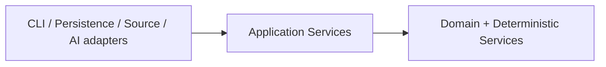

# Calathea Domain Model Architecture

## Purpose

This document maps accepted domain semantics into implementation-facing logical boundaries. It does not replace RFC 0000; it shows where those concepts live and how dependencies flow.

## Logical components

### Domain model

Owns value objects, entities, invariants, and pure validation for:

- Portfolio and Project identity;
- Evaluation and EvaluationVersion;
- PolicySet, PolicySetVersion, PolicyException, and policy-selection decisions;
- OrientationRun and PlacementRecommendation;
- OrientationDisposition and PlacementOverride;
- LifecycleDecision;
- evidence/trace value contracts used by deterministic behavior.

The domain layer does not depend on persistence, CLI, network, GitHub, AI providers, or governance systems.

### Deterministic services

Own pure or deterministic derivation that spans domain records:

- evaluation score calculation;
- policy evaluation;
- policy-exception applicability/application validation;
- orientation candidate selection;
- tie-breaking;
- explanation/trace generation;
- replay validation;
- current-orientation derivation inputs.

These services consume exact versioned inputs and produce immutable outputs.

### Application services

Coordinate commands and queries:

- register/update project metadata by creating new immutable versions;
- accept evaluation drafts into EvaluationVersion records;
- create/activate policy-set versions and record policy selection;
- create/revoke/supersede scoped PolicyException records without mutating prior exceptions;
- run orientation;
- create orientation dispositions and overrides, validating any required PolicyException and retaining PolicyExceptionApplication trace records;
- rebuild projections;
- import optional read-only observations;
- invoke optional AI assistance through a provider port and validate the returned candidate output separately.

Application services own transaction/command boundaries and idempotency orchestration, not domain truth.

### Ports

Stable interfaces required by application services. Initial conceptual ports:

- `RecordStore` — append/load immutable canonical, recommended, and imported records;
- `ProjectionStore` — load/update rebuildable current views;
- `Clock` — explicit application time source where semantics need time;
- `IdentityGenerator` — stable operation/record identity generation;
- `ReadOnlySource` — optional external observation/import interface;
- `AIProvider` — optional provider-invocation interface returning non-authoritative output plus provider provenance.

Domain validation of AI output occurs after the provider call and is not delegated to the provider adapter.

There is **no effect-governance or effect-execution port in v0**. If effectful capabilities are introduced later, their authorization/approval boundary and their execution boundary must be designed separately through a new RFC/ADR rather than added speculatively here.

The exact language-level interfaces are deferred to implementation planning.

## Entity-to-component mapping

| Entity/concept | Primary owner | v0 required? | Notes |
| --- | --- | --- | --- |
| Portfolio | Domain + persistence | Yes | Stable identity and membership |
| Project / ProjectVersion | Domain + persistence | Yes | Repository-independent |
| Evaluation / EvaluationVersion | Domain + deterministic scoring | Yes | Accepted versions canonical |
| EvaluationDraft | Application/domain | Minimal | Manual draft sufficient; AI optional |
| PolicySet / PolicySetVersion | Domain + policy service | Yes | Baseline built-in policies |
| Policy selection decision | Domain + application | Yes | Immutable maintainer selection of one PolicySetVersion |
| PolicyDecision | Policy service / trace | Yes | Part of OrientationRun trace |
| PolicyException | Domain + application | Yes | Required so legal accepted-with-overrides can deviate from exceptionable hard policy when explicitly authorized |
| PolicyExceptionApplication | Deterministic policy service / trace | Yes | Immutable use/application record; enforces scope, expiry, revocation, and maximum-use without mutating the exception |
| OrientationRun | Orientation service | Yes | Immutable deterministic recommendation |
| PlacementRecommendation | OrientationRun | Yes | now/next/later/kill |
| OrientationDisposition | Domain + application | Yes | Maintainer-authored canonical decision |
| PlacementOverride | Disposition | Yes | Explicit rationale; exception ref required only when needed to deviate from an exceptionable hard policy |
| CurrentAcceptedOrientation | Projection | Yes | Rebuildable view |
| LifecycleDecision | Domain + application | Minimal | Needed to preserve lifecycle/orientation separation |
| EvidenceReference / TraceEntry | Domain contract + services | Yes | Structured explanation |
| ReviewCycle / Finding | Review extension | No for first UC-01 slice | Architecture reserves boundary |
| AIInvocation / RecommendationDraft | Application + optional adapter provenance | No | Provider output remains non-authoritative; application validates drafts |
| ExternalSource / SourceReference | Optional adapter | No | Read-only when introduced |
| WorkItem | External/reference only | No | No task tracker in v0 |

An immutable policy-selection decision is the minimal supporting record required if the current policy selection is implemented as a rebuildable projection. It records the selected immutable `PolicySetVersion`, actor/authority, time, operation identity, and supersession relationship.

Policy-exception support is part of the v0 semantic model even if the baseline policy set does not exercise it in every run. The system must not advertise `accepted_with_overrides` while lacking the records needed to validate a hard-policy deviation.

## State classes in architecture

RFC 0000 defines authority, derivation, and durability as independent dimensions. Architecture maps those to storage behavior rather than a single state enum.

### Canonical immutable records

Examples:

- ProjectVersion;
- EvaluationVersion;
- PolicySetVersion;
- policy-selection decisions;
- PolicyException and its revocation/supersession decisions;
- OrientationDisposition;
- LifecycleDecision.

Created only through maintainer-authorized application commands.

### Recommended/deterministic immutable records

Examples:

- OrientationRun;
- PolicyExceptionApplication;
- retained RecommendationDraft.

These records never gain maintainer authority by in-place promotion. `PolicyExceptionApplication` records that an already-authorized exception was validly applied; it does not create the exception itself.

### Imported/observed records

External-authoritative material is normalized or referenced without transferring authority. Imported records are immutable snapshots when retained; freshness is a derived assessment.

### Projections

Examples:

- current project version;
- current lifecycle state;
- current policy-set selection derived from immutable policy-selection decisions;
- current accepted orientation;
- exception-use counts and effective exception validity views.

Projections may be mutated/replaced because they are rebuildable from authoritative/immutable records.

## Candidate consistency boundaries

Architecture intentionally avoids committing to DDD aggregates before storage and transaction semantics are implemented. The minimum command boundaries are:

1. create one immutable authored version/decision;
2. create/revoke/supersede one scoped PolicyException through immutable records;
3. create one complete immutable OrientationRun;
4. create one complete OrientationDisposition together with deterministic validation/application records required to establish its legality;
5. create one immutable policy-selection decision referencing an exact PolicySetVersion, then rebuild/update its current projection;
6. stage/commit one retained external import batch where imports are enabled.

A command either commits its authoritative records completely or leaves no authoritative partial result. Projection failure after authoritative commit is recoverable and must not roll back history.

## Dependency direction

Outbound ports needed by application services are owned inward and implemented by adapters. Domain/deterministic code does not depend on storage, provider, source, or effect ports merely to remain framework-independent.

## Governance independence

No Calathea domain entity references Anthesis.

There is no governance adapter in the v0 architecture. If effectful capabilities are introduced later, a new RFC/ADR must preserve the existing distinction between authorization/approval and effect execution. Anthesis may implement a future authorization/governance adapter, but that decision must not introduce Anthesis-specific domain concepts or make read-only Calathea behavior depend on Anthesis.

## Evolution rule

A future feature should become a new core entity or service only if it carries durable Calathea-specific semantics. Provider-specific or infrastructure-specific behavior stays in adapters.
