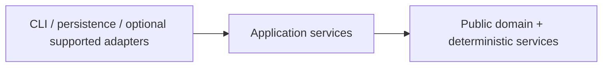

# Community Kernel Domain Architecture

## Purpose

This document maps the domain concepts required by the supported public kernel into implementation-facing boundaries.

It is **not** the complete Calathea product domain model. Product-level planning, review, lifecycle, milestone, archival, stakeholder, and AI workflow semantics are owned by the private `hackelia-micrantha/calathea` repository unless a concrete public compatibility surface requires a subset here.

## Public kernel components

### Core value/entity model

The public kernel may own versioned types and invariants required by its supported orientation/persistence surfaces, including:

- project identity and the minimum project metadata required by public schemas;
- evaluation values/versions required by deterministic evaluation;
- policy/evaluator inputs required by the supported orientation contract;
- orientation run and placement recommendation;
- disposition/override records only where they are part of the supported public persistence/process surface;
- evidence/trace values required to explain public deterministic behavior.

A type is not public merely because the private product uses it. It belongs here only when public process/file/schema behavior depends on it.

### Deterministic services

Own pure or deterministic derivation exposed by the kernel, such as:

- evaluation calculation;
- supported policy/evaluator application;
- candidate eligibility/exclusion;
- bounded queue selection;
- stable tie-breaking;
- public explanation/trace generation;
- replay validation where promised.

These services consume exact versioned inputs and produce reproducible outputs for the public contract.

### Application services

Coordinate supported commands and queries without becoming domain truth.

Examples may include:

- validate/register the minimum public project representation;
- record supported evaluation versions;
- execute deterministic orientation;
- persist supported immutable/versioned records;
- record supported dispositions if part of the public workflow;
- rebuild projections;
- expose machine-readable queries/exports.

Product-specific orchestration should not be added here simply to mirror the private product.

### Ports

Application-owned ports exist only for concrete public needs. Typical examples:

- `RecordStore` — load/append supported records;
- `ProjectionStore` — load/update rebuildable public views;
- `Clock` — explicit time source when public semantics require time;
- `IdentityGenerator` — stable operation/record identity;
- optional adapters only after a supported public contract exists.

Do not add speculative provider, governance, plugin, or effect ports merely because the private product may eventually need them.

## Public state categories

The kernel should distinguish the dimensions needed by its persisted/process contracts rather than publish the complete private product state taxonomy.

### Authoritative/versioned records

Records whose public format/behavior is part of the supported kernel contract.

Examples can include exact project/evaluation/policy versions or caller-authored dispositions when implemented by the public persistence surface.

### Deterministically derived records

Examples include orientation runs, placement results, policy/evaluator diagnostics, and trace data produced from exact versioned inputs.

Derived output does not silently gain caller authority merely because it is deterministic.

### Imported/optional adapter data

If a public adapter is introduced, external data remains attributable and untrusted. It does not silently become authoritative kernel state.

### Projections

Replaceable current views may be used when they are rebuildable from the authoritative/versioned records defined by the public persistence contract.

## Command consistency

A supported authoritative command should either commit its promised records completely or leave no ambiguous partial authoritative result.

Projection failure after authoritative commit is recoverable and must not cause silent history rewrite.

The exact storage technology is an implementation decision unless exposed by a public compatibility contract.

## Dependency direction

Outbound interfaces needed by application services are owned inward and implemented by adapters. Core deterministic code should not depend directly on storage/provider implementations.

## Boundary with private product

The private Calathea product may define richer concepts such as review cycles, findings, lifecycle decisions, milestones, archival policy, stakeholder workflows, structured AI invocations, or governed effects.

Those concepts enter this public architecture only when a concrete public CLI/file/schema/extension surface requires a stable interoperable representation or behavior.

When that happens, extract the minimum public contract rather than copying the complete private product model.

## Evolution rule

Before adding a public entity/service/port, identify the supported public behavior that requires it.

If the justification is only "Calathea product uses this internally," keep it private until an independent public compatibility need exists.
