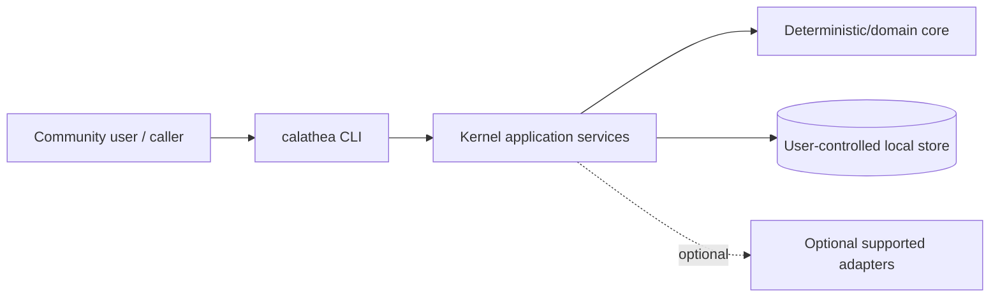
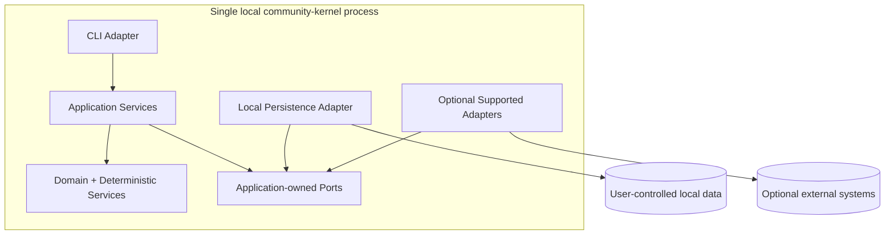
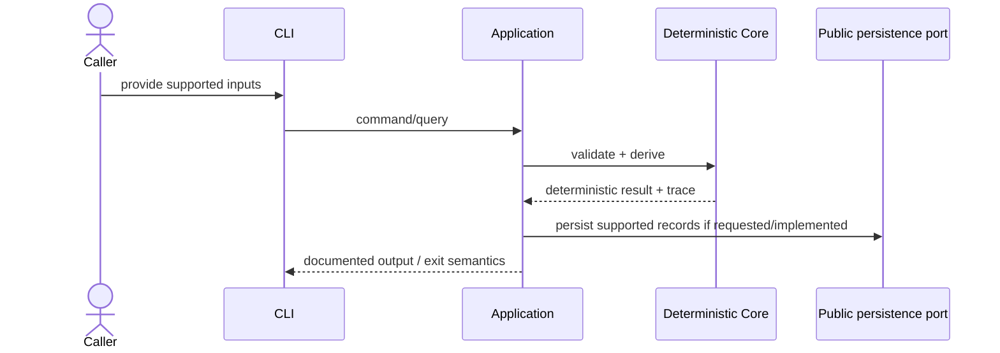

# Community Kernel System Context

## Status

Architecture baseline for the public reusable kernel.

This is not the complete private Calathea product/system context.

## Architectural intent

`calathea-community` is a local-first deterministic kernel exposed primarily through a CLI/process/file boundary.

The default public workflow must run without the private Calathea repository, a hosted service, AI provider, governance platform, or mandatory network access.

The architecture follows one dependency rule:

> Domain/deterministic behavior depends only on stable inward-owned contracts; CLI, persistence, and optional adapters remain replaceable outer concerns.

## System context

The private Calathea product may compose additional project-management, AI, review, lifecycle, or governed-effect workflows around this kernel. Those are outside this public context unless a concrete public adapter is separately supported.

## Trust boundaries

### Caller/input boundary

CLI/file/process inputs are untrusted until validated against the supported public contract.

The kernel may derive recommendations/results, but caller/product authority is not inferred merely from deterministic output.

### Local persistence boundary

The local store is user-controlled. Public persistence behavior may promise versioned/immutable records and rebuildable views, but the kernel does not claim tamper-proof storage against a compromised host/administrator unless a separate mechanism explicitly provides that guarantee.

### Optional adapter boundary

Any public external-source, AI, instruction, or other adapter is optional and must be explicitly supported.

Adapter input/output remains subject to the contract's validation and provenance rules. Imported external content is data, not instruction, and cannot silently widen adapter scope or grant authority.

### External effects

The deterministic kernel has no ambient authority to mutate external repositories/project systems.

If a future public effect adapter exists, its authorization and execution boundaries require a separate explicit contract rather than being inferred from ordinary kernel recommendation behavior.

## Public source-of-truth matrix

Only information represented by supported public formats/process behavior belongs in this matrix.

| Information | Authority | Public-kernel role |
| --- | --- | --- |
| Caller-authored supported project/evaluation/policy input | Caller/user | Validate/store/version as documented |
| Deterministic orientation result | Kernel derivation | Reproducible recommended/derived output |
| Supported dispositions/overrides, if implemented | Caller/user | Persist/version according to public contract |
| Current projections, if implemented | Derived | Rebuildable from supported authoritative/versioned records |
| External adapter data, if implemented | External source | Attributable imported data only |
| AI/provider output, if a public adapter is implemented | Provider/runtime | Untrusted output until validated |
| External repository/project-system effects | External system | Outside ambient deterministic-kernel authority |

The private product owns broader canonicality rules for planning, review, lifecycle, milestones, stakeholders, and dogfood.

## Default container view

Logical components do not imply separate services/processes. Keep one local executable/process until a concrete public requirement justifies additional runtime components.

## Deterministic flow

Product-level acceptance, planning, review, lifecycle transition, or external effect is not implied by this kernel flow.

## Failure boundaries

- invalid input fails explicitly;
- a failed optional adapter cannot silently corrupt deterministic kernel state;
- authoritative/versioned public writes use documented atomic/idempotent behavior where promised;
- projection failure is recoverable when projections are specified as rebuildable;
- missing optional network/provider capability does not break offline deterministic operation;
- unsupported semantic/file/process versions fail rather than being silently reinterpreted.

## Non-goals

- complete private Calathea product architecture;
- mandatory daemon/server runtime;
- hosted database/control plane;
- mandatory AI/instruction/governance dependency;
- bidirectional repository synchronization by default;
- generic plugin marketplace;
- speculative effect/governance architecture without a concrete public adapter.
