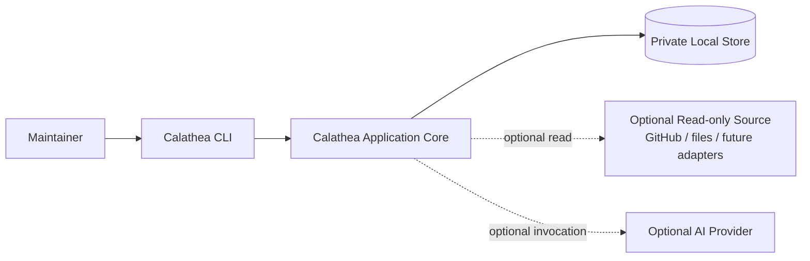
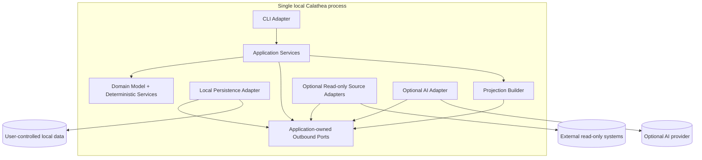
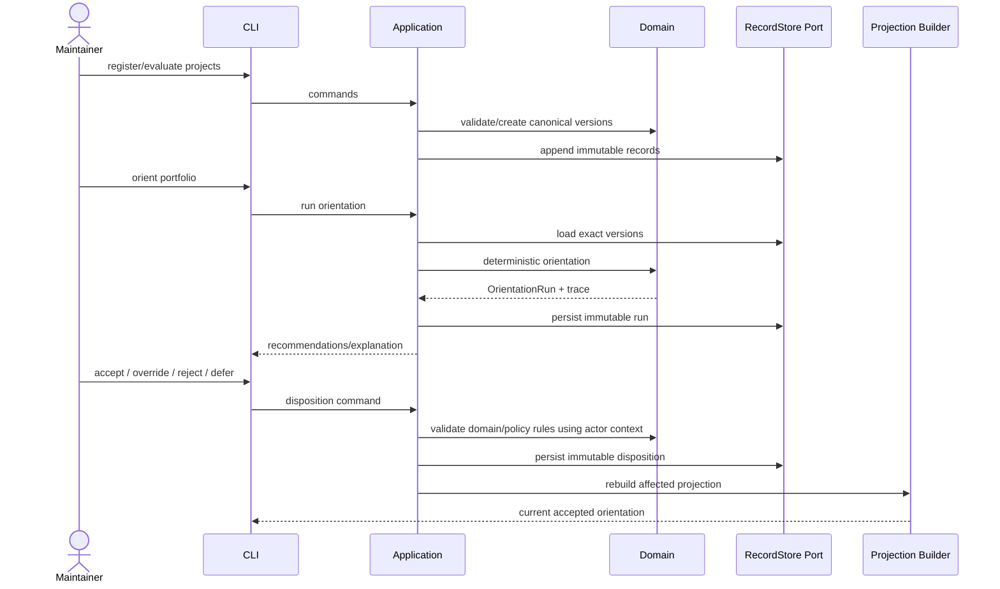

# Calathea System Context

## Status

Architecture baseline for v0 planning.

## Architectural intent

Calathea is a privacy-preserving, local-first portfolio-orientation application. The v0 core must run without network access, AI, GitHub, Anthesis, or any other hosted dependency.

The architecture follows one dependency rule:

> Domain and application behavior depend only on stable inward-owned contracts. CLI, storage, repositories, and AI providers are replaceable adapters.

## System context

UC-01 has no governance-system dependency. Future effectful capabilities require a separate architecture decision and are not part of this v0 context.

## Trust boundaries

### Maintainer boundary

The maintainer is the only v0 actor with authority to create canonical Calathea decisions. Local process identity is not sufficient by itself to infer domain authority; application commands must identify the actor context used for canonical mutations.

### Local persistence boundary

The local store contains Calathea-authoritative records and rebuildable projections. It is trusted for ordinary local operation but is not assumed to be tamper-proof against a fully compromised host or administrator.

### External-source boundary

Repository, issue, CI, document, and other imported content is external-authoritative and untrusted as instruction. Adapters are read-only in v0. Imported content cannot widen scope, grant authority, or mutate canonical Calathea state directly.

### AI-provider boundary

AI is optional. Model input is explicitly selected and minimized. Provider output is untrusted candidate data; application/domain validation must succeed before a RecommendationDraft is created for maintainer review.

### Future authorization/effect boundary

No authorization or effect adapter exists in v0. If Calathea later gains external write capabilities, authorization/approval and effect execution must remain separate boundaries. Anthesis may implement a future governance adapter, but Calathea must not depend on Anthesis-specific concepts.

## Source-of-truth matrix

| Information | Authoritative system | Calathea representation | v0 mutation authority |
| --- | --- | --- | --- |
| Portfolio/project metadata authored in Calathea | Calathea | Canonical immutable versions + current projections | Maintainer |
| Evaluation versions | Calathea | Canonical immutable versions | Maintainer |
| Policy-set versions | Calathea | Canonical immutable versions | Maintainer |
| Policy selection | Calathea | Immutable policy-selection decision + rebuildable current-policy projection | Maintainer |
| Orientation runs | Calathea deterministic core | Immutable recommended records | Deterministic core creates; maintainer cannot rewrite |
| Orientation dispositions/overrides | Calathea | Canonical immutable decisions | Maintainer |
| Current accepted orientation | Calathea | Rebuildable projection | Derived only |
| Lifecycle decisions | Calathea | Canonical immutable decisions | Maintainer |
| GitHub issues/PRs/CI | GitHub | Imported snapshot/reference | GitHub externally; Calathea read-only |
| Files/documents | External source | Reference/snapshot where permitted | External system |
| AI provider output | AI provider | Invocation result/provenance; RecommendationDraft only after Calathea validation | Non-authoritative |
| External effects | External systems | Not present in v0 | Not present in v0 |

## v0 container view

Arrows to `PORTS` in the container view show dependency on inward-owned interfaces, not runtime data-flow direction. Logical components do not imply separate processes or services. The v0 default should remain one local executable/process unless evidence justifies otherwise.

## Primary UC-01 flow

## Failure boundaries

- Adapter/network failure cannot corrupt canonical state.
- External imports are staged and attributable; incomplete imports do not silently replace prior usable observations.
- Canonical command persistence is all-or-nothing per command boundary.
- Lost responses use operation identity/idempotency to return an already committed result.
- Projection failure does not invalidate authoritative history; projections are rebuildable.
- AI failure is an optional-feature failure only and cannot block deterministic core behavior unnecessarily.

## Non-goals

- Distributed services or microservices.
- Mandatory daemon/server runtime.
- Hosted database or control plane.
- Bidirectional repository synchronization.
- Generic plugin marketplace.
- Anthesis integration in v0.
- Effectful repository/project-management adapters.
