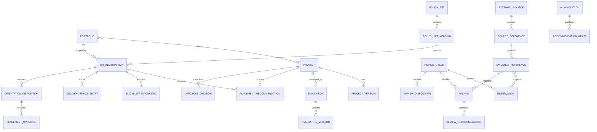

# RFC 0000 — Conceptual Domain Model and Canonical Terminology

## Status

Accepted

- **Owner:** Calathea maintainers
- **Decision date:** 2026-08-03
- **Sources:** [PRD](product/prd.md), [end-to-end use cases](product/use-cases.md)
- **Scope:** Structural domain semantics; no persistence, runtime, transport, or transactional design choice

## Summary

Calathea models portfolio orientation as explicit, attributable records rather than a mutable project list with overloaded status fields.

The v0 decision chain is:

```text
Portfolio + Projects
        ↓
Accepted Evaluation Versions + Policy Set Version
        ↓ deterministic derivation
Orientation Run
        ├─ Placement Recommendations
        ├─ Eligibility Diagnostics
        └─ Decision Trace
        ↓ explicit maintainer response
Orientation Disposition
        ↓ projection when accepted
Current Accepted Orientation
```

Project lifecycle state and portfolio orientation placement are independent dimensions. A lifecycle-active project may be placed in `later`, and a `kill` placement recommendation never changes lifecycle state by itself.

## Context

RFCs 0001–0004 define evaluation, orientation, review, learning, and AI-governance behavior without a shared structural model. This created ambiguity around:

- whether `orientation` means a run, an accepted decision, or a current view;
- whether `kill` is a placement or lifecycle mutation;
- whether observation, finding, recommendation, approval, and mutation are distinct;
- who owns imported, observed, derived, and canonical records;
- whether AI output can become authoritative without a separate decision;
- whether project, repository, work item, goal, and outcome are interchangeable.

This RFC establishes the canonical vocabulary and lifecycle-neutral invariants for later RFCs.

## Decision principles

1. **Identity is stable; mutable meaning is versioned.**
2. **Recommendations are not decisions.**
3. **Decisions are not effects.**
4. **Durable historical records are immutable.**
5. **Current views are rebuildable projections.**
6. **Imported data retains external authority and provenance.**
7. **Lifecycle and orientation are independent dimensions.**
8. **AI output is untrusted recommendation data.**
9. **Domain semantics do not depend on CLI, database, storage engine, or provider choices.**
10. **Every canonical decision or mutation identifies an actor and authority.**

## Conceptual contexts

These are semantic ownership boundaries, not prescribed runtime services or modules.

### Portfolio

Owns portfolio and project identity, project descriptive versions, portfolio membership, and intrinsic eligibility metadata.

### Evaluation

Owns accepted project assessments, drafts, evaluation schemes, rationale, confidence representation, and supersession history.

### Orientation

Owns deterministic runs, placement recommendations, diagnostics, policy traces, maintainer dispositions, overrides, and the current accepted-orientation projection.

### Review and evidence

Owns external/source references, evidence, observations, findings, review recommendations, review dispositions, and optional AI invocation provenance.

### Lifecycle

Owns project lifecycle decisions and outcomes. Lifecycle vocabulary and legal transitions are defined by RFC 0006.

## Record classification

The earlier documents use terms such as canonical, derived, imported, and historical as if they were one mutually exclusive state enum. They are not. A record may be both immutable and canonical, or both derived and historical.

Every durable or externally referenced record must therefore be described along three independent dimensions.

### Authority class

| Class | Meaning |
| --- | --- |
| `canonical` | Maintainer-authorized Calathea record that governs domain behavior |
| `recommended` | Proposed content awaiting maintainer disposition |
| `imported` | Local copy or normalization of externally authoritative data |
| `observed` | Attributable fact or signal derived from canonical or imported data |
| `external_authoritative` | Data owned by another system and only referenced by Calathea |
| `ephemeral` | Non-authoritative working data that may be discarded |

### Derivation class

| Class | Meaning |
| --- | --- |
| `authored` | Entered or explicitly accepted by an authorized actor |
| `deterministic_derived` | Recomputable from retained versioned inputs and semantics |
| `nondeterministic_derived` | Produced by AI or another non-replayable process |
| `projection` | Rebuildable current or convenience view over authoritative records |
| `normalized_import` | Transformation of externally authoritative data without transferring authority |

### Durability class

| Class | Meaning |
| --- | --- |
| `draft` | May be edited or discarded before durable acceptance |
| `immutable_record` | Never edited after durable creation; corrections supersede it |
| `current_view` | Mutable or replaceable projection that must be rebuildable |
| `external_reference` | Durability belongs to another system |

Examples:

| Record | Authority | Derivation | Durability |
| --- | --- | --- | --- |
| Accepted `EvaluationVersion` | canonical | authored | immutable_record |
| `EvaluationDraft` from AI | recommended | nondeterministic_derived | draft or immutable_record by retention policy |
| `OrientationRun` | recommended | deterministic_derived | immutable_record |
| Accepted `OrientationDisposition` | canonical | authored | immutable_record |
| `CurrentAcceptedOrientation` | canonical view | projection | current_view |
| Repository issue snapshot | imported | normalized_import | immutable_record or retained snapshot |
| Repository issue URL | external_authoritative | authored reference | external_reference |

A record never gains authority by changing a flag in place. Promotion from recommended or observed data to canonical meaning requires a distinct maintainer-authorized record.

## Candidate consistency boundaries

The following are candidate domain consistency boundaries. They are not final aggregate or transaction boundaries; accepted architecture decisions may combine or separate them after persistence and atomicity requirements are understood.

### Portfolio record set

Root concept: `Portfolio`

Contains or references:

- stable portfolio identity;
- title and description;
- project membership;
- default planning-horizon metadata;
- default policy-set reference where applicable.

It does not contain full project, evaluation, orientation, or policy history.

### Project record set

Root concept: `Project`

Contains or references:

- stable project identity;
- immutable `ProjectVersion` records;
- current-project-version projection;
- external source references;
- intrinsic visibility or eligibility metadata;
- lifecycle decisions when lifecycle support is enabled.

A project never owns its current orientation placement.

### Evaluation record set

Root concept: `Evaluation`

Contains or references:

- stable evaluation-stream identity;
- project identity;
- immutable accepted `EvaluationVersion` records;
- optional `EvaluationDraft` records;
- supersession relationships;
- actor, authority, scheme, and semantic versions.

An AI-generated or incomplete draft does not become an `EvaluationVersion` until a maintainer explicitly accepts it.

### Policy record set

Root concept: `PolicySet`

Contains or references:

- stable policy-set identity;
- immutable `PolicySetVersion` records;
- effective policy definitions or references;
- semantic versions;
- activation and supersession decisions.

Policy composition and exception legality are defined by RFC 0007.

### Orientation run record set

Root concept: `OrientationRun`

One immutable deterministic derivation containing or referencing:

- portfolio identity and planning horizon;
- considered project identities;
- exact evaluation-version references;
- exact policy-set-version reference;
- imported or observed input references;
- scoring, policy, schema, and orientation semantic versions;
- placement recommendations;
- eligibility diagnostics;
- decision-trace entries;
- input digests or stable references;
- operation identity and creation metadata.

An orientation run is recommended, deterministically derived, and immutable. It never becomes canonical by mutation.

### Orientation disposition record set

Root concept: `OrientationDisposition`

One immutable maintainer response to one run:

- run reference;
- disposition kind;
- actor and authority;
- rationale;
- placement overrides;
- policy-exception references where applicable;
- timestamp;
- relationship to prior accepted dispositions.

Allowed kinds:

- `accepted`;
- `accepted_with_overrides`;
- `rejected`;
- `deferred`.

Only accepted dispositions contribute to the current accepted-orientation projection.

### Review record set

Root concept: `ReviewCycle`

Contains or references:

- review scope and subject;
- evidence coverage;
- observations;
- findings;
- review recommendations;
- maintainer dispositions;
- semantic versions;
- links to separately initiated evaluation, orientation, or lifecycle workflows.

A review may validly produce no finding and no canonical mutation.

### Lifecycle decision record set

Root concept: `LifecycleDecision`

One immutable maintainer-authorized transition record containing prior state, requested state, resulting state, rationale, outcome, evidence, actor, authority, and lifecycle semantic version.

A `kill` placement recommendation may be cited as evidence but is never the transition command.

### AI invocation record set

Root concept: `AIInvocation`

Contains invocation provenance sufficient for the configured retention policy:

- operation and invocation identity;
- provider and model metadata;
- prompt/template and output-schema versions;
- selected-context references or privacy-preserving digests;
- redaction and validation results;
- output recommendation-draft references;
- retention policy;
- optional Anthesis authorization reference.

Raw model output is never canonical domain state.

## Entity relationship model



The diagram shows conceptual cardinality. It does not prescribe foreign keys, ownership cascades, transaction boundaries, or storage layout.

## Canonical entity definitions

### Portfolio

A stable identity for a set of projects considered together during orientation.

A portfolio may contain zero or more projects. A project may belong to more than one portfolio; v0 may constrain this operationally without changing the conceptual identity model.

### Project

A stable identity for a software project or substantial workstream.

A project is not a repository. It may reference zero, one, or many repositories, documents, issue trackers, or other external systems.

### ProjectVersion

An immutable snapshot of maintainer-authored project description: problem, intended outcomes, constraints, ownership, and references.

Accepted versions are canonical immutable records. The current version is a rebuildable projection.

### Goal

A desired condition associated with a project. In v0, goals are project-version content rather than independent entities.

### IntendedOutcome

The observable result the project is expected to achieve. It differs from `Outcome`, which records what actually occurred.

### WorkItem

An implementation or operational unit owned primarily by an external execution system.

Work items are not required by UC-01 and are not a Calathea-owned v0 entity. Calathea may reference or import them as evidence. Use `WorkItem`, not the overloaded term `Task`, in generic normative text.

### Evaluation

The stable identity of one project's assessment stream under one evaluation scheme.

A project may have multiple streams only when schemes are explicitly distinct. Each stream has many immutable versions.

### EvaluationVersion

An immutable, attributable assessment accepted as canonical orientation input.

It records:

- axis values;
- rationale per axis;
- confidence representation;
- evaluation and freshness timestamps;
- evaluation scheme and semantic versions;
- actor and authority;
- evidence references;
- superseded-version reference when applicable.

RFC 0001 owns the axes, formula, scale rubrics, confidence semantics, and calibration rules.

### EvaluationDraft

A non-canonical proposed assessment created by a maintainer workflow or AI assistant. Acceptance creates a distinct immutable `EvaluationVersion`; it does not mutate the draft into canonical state.

### Policy

A constraint, preference, eligibility rule, capacity rule, or decision rule affecting orientation.

### PolicySet

The stable identity of a coherent policy configuration.

### PolicySetVersion

The immutable effective policy definitions and precedence used by a run.

### PolicyDecision

The deterministic result of applying one policy to one subject during a run. It belongs to the run's decision trace and is not a maintainer decision or authorization.

### PlanningHorizon

The explicit temporal or operational scope of an orientation run. It is a value object unless future use cases require independent identity.

### OrientationRun

An immutable deterministic derivation of placement recommendations from exact versioned inputs.

It is never itself accepted, current, or canonical.

### PlacementRecommendation

One proposed placement for one considered project within a run.

Allowed v0 values:

- `now`;
- `next`;
- `later`;
- `kill`.

Placement is recommendation data, not project lifecycle state.

### EligibilityDiagnostic

A structured explanation of why a project was included, excluded, blocked, downgraded, or indeterminate.

Every considered project must have exactly one placement recommendation or an explicit diagnostic explaining why no placement was produced.

### DecisionTraceEntry

A structured explanation component describing a score contribution, policy decision, capacity effect, tie-breaker, freshness effect, or other material derivation step.

### OrientationDisposition

The maintainer's immutable response to one run.

A run may have multiple historical dispositions, but accepted dispositions must have explicit supersession or conflict rules. RFC 0005 defines effective-selection semantics.

### PlacementOverride

A maintainer-authorized replacement for one recommendation within an `accepted_with_overrides` disposition.

It records original and replacement placement, rationale, actor, authority, and required policy-exception reference.

### AcceptedOrientation

The effective placements obtained by applying one accepted disposition and its valid overrides to one orientation run.

It is a deterministic interpretation, not an independently mutable entity.

### CurrentAcceptedOrientation

A rebuildable projection selecting the effective accepted orientation for a portfolio and planning scope.

Rejected and deferred dispositions never replace it.

### ReviewCycle

An immutable review record covering a defined subject, evidence scope, semantic version, and maintainer dispositions.

### Observation

An attributable factual or normalized statement about canonical or imported data. It is not automatically a finding.

### Finding

An evidence-backed interpretation that an observation or group of observations materially violates, diverges from, or challenges an expectation.

### ReviewRecommendation

A proposed response to a finding. It has no mutation authority.

### ReviewDisposition

The maintainer's response to a finding or review cycle: affirm, dismiss, defer, or initiate a separately authorized workflow.

### Transition

The abstract change from one legal lifecycle state to another. A transition is validated and recorded by a `LifecycleDecision`.

### LifecycleDecision

The maintainer-authorized immutable record that changes Calathea-owned project lifecycle state.

### Outcome

The actual recorded result of work. It differs from `IntendedOutcome` and from orientation placement.

### EvidenceReference

A provenance-bearing reference to material supporting an evaluation, policy decision, finding, recommendation, disposition, lifecycle decision, or outcome.

Detailed evidence identity, retention, availability, redaction, and integrity semantics are defined by RFC 0008.

### Provenance

Metadata describing origin, producer, collection or authoring time, transformations, and custody. It is attached to records and references rather than assumed to be an independent aggregate.

### ExternalSource

A stable identity for an external system, repository, document corpus, or provider from which Calathea reads data.

### SourceReference

A locator and identity reference to external-authoritative material. A source reference does not imply Calathea owns or can retain the content.

### ImportedObservation

Do not create a parallel hierarchy by default. Represent imported data as `Observation` plus imported provenance unless adapter requirements prove a distinct normalized-record type is necessary.

### Actor

An identifiable subject that authored, invoked, accepted, or performed an operation.

Actor types may include maintainer, deterministic component, external adapter, AI provider/model, or Anthesis-governed principal.

### Authority

The capability or responsibility under which an actor acts. Identity and authority are distinct.

For v0, only the maintainer has authority to create canonical Calathea decisions.

### Owner

A descriptive responsibility relationship to a project or portfolio. Ownership does not confer authorization.

### AIInvocation

An attributable record of a scoped model invocation and validation pipeline.

### RecommendationDraft

Non-canonical structured output produced by AI or another assistant workflow.

The draft must record its intended target type, such as evaluation draft or review recommendation. Acceptance creates a distinct canonical record where permitted.

### SemanticVersionReference

A stable reference to the versioned rules required to interpret or replay a record: schema, evaluation, scoring, policy, orientation, review, lifecycle, or explanation semantics.

An application build version alone is insufficient.

## Identity and versioning rules

### Stable identity

Stable identity independent of mutable names is required for:

- portfolio;
- project;
- evaluation stream;
- policy set;
- orientation run;
- orientation disposition;
- review cycle;
- lifecycle decision;
- retained evidence and source references;
- AI invocation when retained.

### Immutable records

After durable creation, these records are immutable:

- project version;
- evaluation version;
- policy-set version;
- orientation run;
- orientation disposition;
- review cycle and recorded review dispositions;
- lifecycle decision;
- retained AI invocation provenance.

Corrections create superseding records with explicit causal links.

### Deterministic identity

A deterministic record must reference:

- complete immutable inputs or stable content identities;
- semantic versions;
- deterministic ordering and tie-breaking rules;
- operation identity.

Whether a run identifier is random or content-addressed is deferred. Replay equivalence must not depend on identifier format.

### Current views

Current project version, current lifecycle state, and current accepted orientation may be cached, but each must be rebuildable from authoritative immutable records.

Retention, deletion, compaction, and recovery semantics are defined by RFC 0005.

## Cardinality rules

- A portfolio includes zero or more projects.
- A project may be included in one or more portfolios.
- A project has many project versions and exactly one effective current version when registered and complete.
- A project may have one evaluation stream per evaluation scheme and many evaluation versions per stream.
- An orientation run covers one portfolio and one explicit planning horizon.
- An orientation run references exactly one effective evaluation version per eligible considered project.
- An orientation run references exactly one policy-set version.
- Every considered project has zero or one placement recommendation and at least one diagnostic when no placement exists.
- A run may have multiple historical dispositions, but accepted dispositions require explicit effective-selection or supersession semantics.
- An accepted-with-overrides disposition has zero or more placement overrides.
- A review cycle may produce zero or more observations, findings, recommendations, and dispositions.
- A finding references one or more observations or evidence references.
- A lifecycle decision applies to one project and one legal transition.
- An AI invocation produces zero or more recommendation drafts and no canonical records directly.

## Core invariants

### Project and placement

- A project exists independently of orientation.
- A project never stores `now`, `next`, `later`, or `kill` as intrinsic lifecycle state.
- Current placement is derived from an effective accepted disposition.
- Rejected or deferred dispositions do not change current placement.
- `kill` never triggers lifecycle or external effects automatically.

### Recommendation, decision, mutation, effect

- A placement recommendation is deterministic derived output.
- An orientation disposition is a maintainer decision.
- A lifecycle decision is a separate canonical mutation.
- An external effect is separate from both and out of scope for v0.
- Anthesis authorization, when present, authorizes effects but does not define Calathea domain truth.

### History and correction

- Orientation runs remain immutable whether accepted, rejected, deferred, or superseded.
- Overrides never modify original recommendations.
- Corrections preserve causal and supersession links.
- A no-op review and an affirmed unchanged orientation are valid.

### Authority

- Deterministic components may derive but not accept.
- AI may recommend but not accept.
- External adapters may import but not promote.
- Only the maintainer creates canonical decisions in v0.

### Privacy

- Credential values are not domain entities.
- Credentials remain in integration configuration or secret-management facilities outside portfolio records, prompts, evidence, traces, and model context.
- Private portfolio records remain local by default.

## Canonical glossary

| Canonical term | Definition | Avoid or replace |
| --- | --- | --- |
| Portfolio | Set of projects considered together | workspace or board when portfolio is meant |
| Project | Stable project/workstream identity | repository when not identical |
| ProjectVersion | Immutable descriptive snapshot | mutable project document |
| IntendedOutcome | Desired future result | outcome when desired |
| Outcome | Actual recorded result | goal when actual |
| WorkItem | Externally owned execution unit | task as overloaded core entity |
| EvaluationVersion | Accepted immutable assessment | mutable evaluation or score record |
| EvaluationDraft | Non-canonical proposed assessment | AI evaluation when authority is implied |
| PolicySetVersion | Immutable effective policy configuration | rules blob |
| PolicyDecision | Result of applying a policy | approval or maintainer decision |
| OrientationRun | Immutable deterministic derivation | orientation snapshot when ambiguous |
| PlacementRecommendation | Proposed `now/next/later/kill` value | bucket or status |
| OrientationDisposition | Maintainer response to a run | approval when reject/defer are possible |
| PlacementOverride | Maintainer replacement of a recommendation | manual score change |
| AcceptedOrientation | Effective placements from one accepted disposition | canonical run |
| CurrentAcceptedOrientation | Rebuildable current projection | current run |
| Observation | Attributable factual statement | finding when no judgment exists |
| Finding | Evidence-backed material interpretation | observation when merely factual |
| ReviewRecommendation | Proposed response | corrective action when not authorized |
| ReviewDisposition | Maintainer response to review/finding | mutation |
| LifecycleState | Project execution/existence phase | placement |
| LifecycleDecision | Authorized transition record | kill recommendation |
| EvidenceReference | Provenance-bearing support reference | raw link without metadata |
| Actor | Identified performer or author | owner when authority is meant |
| Authority | Capability/responsibility under which actor acts | identity |
| AIInvocation | Scoped attributable model call | agent action when autonomy is absent |
| RecommendationDraft | Non-canonical assistant output | generated decision |
| SemanticVersionReference | Version of rules needed to interpret/replay | application version alone |

## Terms removed or constrained

### `Bucket`

Do not use as a normative domain term. Use `PlacementRecommendation` or accepted placement. UI copy may use “bucket” informally.

### `AcceptedPlacement`

Use `OrientationDisposition` plus `AcceptedOrientation`. Partial acceptance is not supported unless a later use case and RFC introduce it explicitly.

### `Approval`

Do not use as a generic entity. Use the specific record:

- `OrientationDisposition`;
- `ReviewDisposition`;
- `LifecycleDecision`;
- Anthesis authorization.

### `State`

Never use unqualified in normative text. Name the exact concept: lifecycle state, authority class, durability class, placement recommendation, current accepted orientation, or imported observation.

### `Kill`

Use only as the literal placement value `kill`. Use cancel, complete, archive, or another defined lifecycle transition for project state.

### `Learning`

For v0, use `Outcome` or `CalibrationSignal`. Automatic weight, policy, or heuristic mutation is deferred.

### `Task`

Use `WorkItem` unless referring to a concrete external system's native task type.

### `Aggregate`

Use only after consistency and atomicity requirements are documented. In this RFC, the defined groups are candidate consistency boundaries, not final DDD aggregates.

## Crosswalk to existing RFCs

### RFC 0001 — Evaluation semantics

Owns:

- evaluation scheme and axes;
- scale rubrics and validation;
- scoring semantics;
- confidence representation;
- calibration guidance.

Must stop owning orientation lifecycle and queue-policy semantics.

Required terminology:

- accepted assessment → `EvaluationVersion`;
- proposed assessment → `EvaluationDraft`;
- orientation output → recommendations within an `OrientationRun`.

### RFC 0002 — Orientation and policy execution

Owns:

- deterministic orientation derivation;
- eligibility and diagnostics;
- placement recommendations;
- capacity limits;
- policy decisions, precedence, tie-breaking, and explanation trace.

Required changes:

- persisted `bucket` → `PlacementRecommendation` or `CurrentAcceptedOrientation` projection;
- result → immutable `OrientationRun`;
- user acceptance/override → `OrientationDisposition`;
- drift taxonomy moves to RFC 0003 or a shared review contract.

### RFC 0003 — Review and feedback

Owns:

- review cycles;
- observations;
- findings;
- review recommendations;
- review dispositions;
- outcomes and calibration signals.

Required changes:

- reviews may validly produce no findings and no mutation;
- recommendation, disposition, and later action remain separate records;
- automatic heuristic mutation is deferred;
- lifecycle and orientation actions use their own workflows.

### RFC 0004 — AI governance

Uses:

- `AIInvocation`;
- selected-context references;
- `RecommendationDraft`;
- structured validation;
- maintainer acceptance creating a distinct canonical record;
- optional Anthesis authorization references.

Required changes:

- AI output never directly creates canonical evaluations, dispositions, findings, lifecycle decisions, or external effects;
- Anthesis authorization is not a Calathea domain decision;
- model nondeterminism is distinct from orientation determinism.

## MVP-required subset

UC-01 requires only:

- `Portfolio`;
- `Project` and `ProjectVersion`;
- `Evaluation` and `EvaluationVersion`;
- `PolicySet` and `PolicySetVersion`;
- `PlanningHorizon`;
- `OrientationRun`;
- `PlacementRecommendation`;
- `EligibilityDiagnostic`;
- `DecisionTraceEntry`;
- `OrientationDisposition`;
- `PlacementOverride`;
- `AcceptedOrientation` interpretation;
- `CurrentAcceptedOrientation` projection;
- actor and authority references;
- evidence/source references sufficient for provenance;
- semantic-version references.

Not required for the first executable slice:

- independently managed goals;
- Calathea-owned work items;
- lifecycle decisions beyond preserving the semantic boundary;
- review cycles;
- AI invocation;
- generic adapter framework.

## Consequences

### Benefits

- Later RFCs share one structural vocabulary.
- UC-01 can distinguish run, disposition, accepted interpretation, projection, and lifecycle state.
- Rejected, deferred, and overridden recommendations remain auditable.
- AI and imported data retain explicit non-authoritative boundaries.
- Persistence choices remain open.

### Costs

- More explicit records than a mutable project table.
- Implementations must preserve causal references and semantic versions.
- Current views require rebuild logic.
- Existing RFC terminology requires reconciliation.

### Risks and mitigations

- **Over-modeling:** only the MVP subset is required initially.
- **Premature aggregate design:** candidate boundaries are explicitly non-binding.
- **Accidental event-sourcing commitment:** immutable records and rebuildable views do not require event sourcing.
- **State-class ambiguity:** authority, derivation, and durability are separate dimensions.

## Deferred decisions

- Effective selection, retention, deletion, redaction, and recovery semantics: RFC 0005.
- Lifecycle states and legal transitions: RFC 0006.
- Policy composition, precedence, exceptions, and override legality: RFC 0007.
- Evidence, provenance, and explanation schemas: RFC 0008.
- AI context and invocation semantics: RFC 0004 plus the public architecture integration contracts.
- Persistence, runtime, module boundaries, transactions, and deployment: accepted architecture decisions in `docs/adr/` and `docs/architecture/`.

## Acceptance criteria

This RFC is accepted because:

- every concept referenced by RFCs 0001–0004 is defined or explicitly removed;
- lifecycle state and orientation placement are independent;
- recommendation, disposition, lifecycle mutation, and external effect are distinct;
- authority, derivation, and durability classifications are explicit and non-conflicting;
- candidate consistency boundaries remain implementation-neutral;
- identity, versioning, and cardinality expectations are defined;
- the glossary is authoritative for later RFCs;
- UC-01 can be described without ambiguous `state`, `bucket`, `approval`, or `orientation` terminology;
- no database, event-sourcing, runtime, transport, or transaction choice is prescribed.
