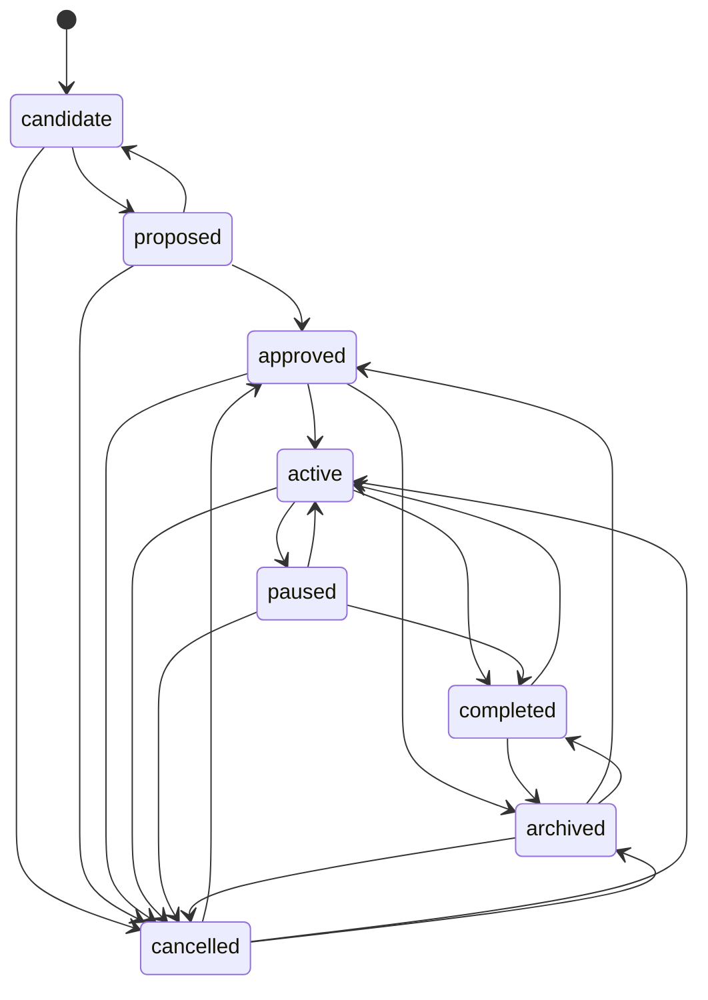

# RFC 0006 — Project Lifecycle and Legal Transitions

## Status

Accepted

- **Owner:** Calathea maintainers
- **Decision date:** 2026-08-03
- **Depends on:** RFC 0000, RFC 0005, PRD, UC-02, UC-04
- **Scope:** Project lifecycle vocabulary, transition authority, outcomes, and recovery semantics

## Summary

Calathea models project lifecycle independently from portfolio orientation.

Lifecycle answers:

> What phase is this project in?

Orientation answers:

> Where should this project receive attention relative to other projects?

A lifecycle-active project may be recommended for `later`. A lifecycle-proposed project may be recommended for `now`. A `kill` placement recommendation never changes lifecycle state.

Lifecycle changes occur only through immutable maintainer-authorized `LifecycleDecision` records. The current lifecycle state is a rebuildable projection over accepted lifecycle decisions.

## Goals

- Define a minimal lifecycle suitable for UC-02 and UC-04.
- Make legal and illegal transitions explicit.
- Separate lifecycle state from orientation placement, review findings, and external repository status.
- Define actor, authority, evidence, outcome, and recovery requirements.
- Preserve auditable history without prescribing persistence technology.

## Non-goals

- Defining issue or work-item workflow states.
- Mirroring GitHub project or repository status fields.
- Automatically synchronizing lifecycle state to external systems.
- Treating `kill` placement as a lifecycle command.
- Requiring every project to progress through every state.
- Defining detailed policy-exception semantics owned by RFC 0007.

## Lifecycle model

The v0 lifecycle states are:

```text
candidate
proposed
approved
active
paused
completed
cancelled
archived
```

`rejected` is represented as a transition outcome from `proposed` to `cancelled` with reason `rejected`, rather than as a separate durable lifecycle state.

`blocked` is not a lifecycle state. It is an operational condition or finding that may cause an explicit transition from `active` to `paused`.

`killed` is not a lifecycle state. Use `cancelled` with an explicit reason such as `stop_investing`, `superseded`, `invalidated`, or `rejected`.

## Why this vocabulary

The candidate model intentionally removes states that encode ambiguous planning detail:

- `idea` becomes `candidate` because Calathea manages portfolio candidates, not only ideas.
- `planned` is omitted because planning completeness is evidence or policy, not a durable lifecycle phase.
- `blocked` is omitted because blockers may be transient and externally observed.
- `killed` is omitted to avoid collision with orientation value `kill`.
- `rejected` is represented by cancellation reason, preserving the decision without expanding terminal states.

## State definitions

### `candidate`

A project identity exists, but intent and viability are not yet sufficient for a reviewable proposal.

**Entry criteria**

- stable project identity;
- minimal title or locator;
- maintainer-authorized registration.

**Permitted work**

- gather intent, constraints, intended outcome, uncertainty, and source references;
- create evaluation drafts;
- import read-only evidence.

**Exit criteria**

- to `proposed`: a reviewable project version exists;
- to `cancelled`: the candidate is explicitly abandoned or determined to be duplicate/invalid.

### `proposed`

A reviewable project proposal exists and awaits an explicit approval or rejection decision.

**Entry criteria**

- accepted project version with problem, intended outcome, ownership, and material constraints;
- provenance for imported assertions where used.

**Permitted work**

- evaluate viability and priority;
- request clarification;
- defer decision without changing state.

**Exit criteria**

- to `approved`: maintainer accepts the proposal;
- to `candidate`: proposal is withdrawn for substantive reshaping;
- to `cancelled`: proposal is rejected or abandoned.

### `approved`

The maintainer has authorized the project to exist as intentional portfolio work, but execution is not currently underway.

**Entry criteria**

- explicit maintainer approval;
- current project version;
- recorded rationale and authority.

**Permitted work**

- refine planning and evaluation;
- orient in `now`, `next`, or `later`;
- prepare external execution work.

**Exit criteria**

- to `active`: execution begins under explicit maintainer decision;
- to `cancelled`: authorization is withdrawn before completion;
- to `archived`: project is retained for reference without execution intent.

### `active`

The project is under current execution or active stewardship.

**Entry criteria**

- explicit maintainer start/resume decision;
- current approved project version;
- no non-overridable lifecycle precondition failure.

**Permitted work**

- implementation, investigation, coordination, or operational stewardship;
- orientation in any placement, including `later` or `kill`, without automatic lifecycle change.

**Exit criteria**

- to `paused`: execution intentionally stops temporarily;
- to `completed`: work concludes and outcome evidence is recorded;
- to `cancelled`: work is intentionally terminated before completion;
- to `archived`: only after first reaching `completed` or `cancelled`.

### `paused`

Execution is intentionally suspended, while continuation remains plausible.

**Entry criteria**

- explicit maintainer decision;
- reason such as blocked dependency, capacity, strategic deferment, or external constraint;
- optional review date or resumption condition.

**Permitted work**

- gather unblock evidence;
- revise evaluation or project version;
- remain oriented independently.

**Exit criteria**

- to `active`: explicit resume decision;
- to `completed`: only when completion evidence shows execution was already substantively complete;
- to `cancelled`: continuation is intentionally abandoned;
- to `archived`: only after cancellation or completion.

### `completed`

Execution has concluded and an actual outcome has been recorded.

Completion does not mean success.

**Entry criteria**

- explicit maintainer decision;
- outcome record classifying result as successful, partial, unsuccessful, superseded, or no-longer-needed;
- evidence sufficient to explain the conclusion;
- known residual work or risk recorded where material.

**Permitted work**

- retrospective review;
- outcome comparison;
- correction through superseding outcome/lifecycle records.

**Exit criteria**

- to `active`: explicit reopen decision with rationale;
- to `archived`: normal retention transition.

### `cancelled`

The project is intentionally stopped without being represented as completed work.

**Entry criteria**

- explicit maintainer decision;
- cancellation reason;
- outcome or disposition evidence sufficient to explain the stop decision.

Recommended reasons include:

- `rejected`;
- `duplicate`;
- `invalidated`;
- `superseded`;
- `stop_investing`;
- `capacity`;
- `strategy_changed`;
- `external_dependency`;
- `other` with rationale.

**Exit criteria**

- to `approved`: explicit revive decision when no execution had begun or historical execution is irrelevant;
- to `active`: explicit reopen decision when execution history should continue;
- to `archived`: normal retention transition.

### `archived`

The project remains retained for history and reference but is excluded from normal active lifecycle and orientation workflows.

**Entry criteria**

- prior state is `approved`, `completed`, or `cancelled`;
- explicit maintainer archive decision;
- no unresolved requirement that mandates active visibility.

**Exit criteria**

- to the prior effective non-archived state through explicit restore decision;
- restoration does not erase the archive decision.

## State diagram



The archived restore target is derived from the archive decision's recorded prior state. The diagram shows allowed categories rather than permitting arbitrary archived transitions.

## Legal transition matrix

| From | To | Legal | Minimum rationale/evidence |
| --- | --- | --- | --- |
| none | candidate | yes | registration identity and actor |
| candidate | proposed | yes | reviewable accepted project version |
| candidate | cancelled | yes | abandonment/duplicate/invalid reason |
| proposed | approved | yes | explicit approval rationale |
| proposed | candidate | yes | withdrawal for reshaping |
| proposed | cancelled | yes | rejection or abandonment reason |
| approved | active | yes | explicit start decision |
| approved | cancelled | yes | withdrawal reason |
| approved | archived | yes | reference-only intent |
| active | paused | yes | suspension reason and optional review condition |
| active | completed | yes | outcome evidence |
| active | cancelled | yes | termination reason and outcome/disposition evidence |
| paused | active | yes | resume rationale |
| paused | completed | conditional | evidence work was substantively complete |
| paused | cancelled | yes | abandonment reason |
| completed | active | yes | reopen rationale and residual objective |
| completed | archived | yes | archive rationale |
| cancelled | approved | yes | revive rationale and refreshed project version if stale |
| cancelled | active | conditional | reopen rationale plus execution readiness |
| cancelled | archived | yes | archive rationale |
| archived | prior state | yes | restore rationale and recorded prior state |
| active | archived | no | must complete or cancel first |
| paused | archived | no | must complete or cancel first |
| any | same state | no-op | no new lifecycle decision unless rationale/history requires reaffirmation |

All unlisted transitions are invalid by default.

## Lifecycle decision contract

A lifecycle transition is represented by one immutable `LifecycleDecision` containing:

- decision identity;
- project identity;
- expected current lifecycle decision/reference;
- prior state;
- requested state;
- actor identity;
- authority;
- reason code and rationale;
- evidence references;
- outcome reference where required;
- semantic version;
- operation/idempotency identity;
- decision time;
- supersession/correction references where applicable.

The decision is the authoritative record. The resulting current lifecycle state is a projection.

## Authority model

### Maintainer

The maintainer is the only v0 authority permitted to create lifecycle decisions.

### Deterministic engine

May validate transitions and produce diagnostics. It cannot approve or perform a transition independently.

### AI assistant

May draft rationale, outcome summaries, or transition recommendations. It cannot create a lifecycle decision.

### External adapter

May provide observed status or evidence. External state never automatically promotes a project to `active`, `completed`, `cancelled`, or `archived`.

### Anthesis

Where integrated, Anthesis may authorize an effectful external action. It does not define Calathea lifecycle truth and is not required for local lifecycle decisions in v0.

## Orientation relationship

Lifecycle and orientation are orthogonal.

| Lifecycle state | Orientation eligibility |
| --- | --- |
| candidate | normally excluded; may appear in intake views |
| proposed | may be considered for recommendation if policy permits |
| approved | eligible |
| active | eligible |
| paused | eligible, often with diagnostic or policy effect |
| completed | excluded from normal active orientation |
| cancelled | excluded from normal active orientation |
| archived | excluded |

A `kill` placement recommendation:

- records a recommendation to stop investing;
- may support a later cancellation decision;
- does not alter lifecycle state;
- does not archive, delete, close, or mutate external systems.

An accepted `kill` placement still requires a separate lifecycle decision to cancel or otherwise transition the project.

## Paused versus blocked

`paused` is canonical lifecycle state.

`blocked` is an observed or reviewed condition, such as:

- unavailable dependency;
- unresolved external approval;
- missing access;
- technical blocker;
- insufficient information.

A blocker may:

- leave an `active` project active while work continues elsewhere;
- prompt a recommendation to pause;
- cause an explicit transition to `paused`.

It never changes lifecycle state automatically.

## Completion and outcomes

Completion requires an `Outcome` record or equivalent outcome content.

Outcome result values should include at minimum:

- `successful`;
- `partial`;
- `unsuccessful`;
- `superseded`;
- `no_longer_needed`.

Completion is valid with an unsuccessful outcome when the work has genuinely concluded and the result is documented.

A cancelled project may also record an outcome, but cancellation does not falsely claim execution completion.

## Cancellation versus completion versus archival

### Completion

Use when execution reached a concluded result, regardless of success.

### Cancellation

Use when the project is intentionally stopped before representing the work as completed.

### Archival

Use as a retention/visibility state after approval, completion, or cancellation. Archival does not describe project outcome.

### Stop investing

Use `cancelled` with reason `stop_investing` when the maintainer accepts the strategic decision to end work.

Do not use `killed` as lifecycle vocabulary.

## Reopen and restore semantics

Reopening creates a new lifecycle decision; it never deletes or reverses the prior decision.

A reopen decision must state:

- why prior completion/cancellation no longer governs current intent;
- whether the existing project version remains valid;
- the new objective or residual work;
- relevant evidence or changed conditions.

Restoring from archive returns to the recorded prior effective state unless the maintainer explicitly chooses another legal transition through a separate decision.

## Correction semantics

A lifecycle decision is immutable after durable creation.

If a decision contains factual or semantic error:

1. create a superseding correction record;
2. reference the erroneous decision;
3. identify actor, reason, and time;
4. recompute the current lifecycle projection;
5. preserve the original unless redaction/deletion policy requires otherwise.

A correction is distinct from a new business decision. The system must expose which occurred.

## Concurrency and idempotency

Lifecycle commands must include:

- expected current lifecycle reference or revision;
- stable idempotency identity;
- equivalent payload validation on retry.

If the expected state is stale, reject the transition with diagnostics showing:

- expected state/reference;
- current state/reference;
- attempted transition;
- legal transitions from the current state.

Retrying the same operation identity with equivalent content returns the original result. Reusing it with materially different content fails.

## Invalid-transition diagnostics

An invalid transition response must identify:

- project identity;
- current lifecycle state;
- requested lifecycle state;
- violated precondition or illegal edge;
- required evidence or authority, when applicable;
- legal next transitions;
- whether the failure is retryable after state refresh or evidence update.

The engine must not silently coerce an invalid transition into a nearby legal state.

## Atomicity and recovery

Recording a lifecycle decision and advancing the current-state projection is one logical authoritative command.

Required behavior:

- before durable commit: no success is reported;
- after durable commit but lost response: retry returns the original result;
- projection update failure: authoritative decision remains valid and projection is rebuilt;
- conflicting concurrent transition: one succeeds; stale commands fail explicitly;
- external-effect failure: lifecycle decision remains distinct from the failed effect and must not be fabricated as rolled back.

For v0, lifecycle decisions do not require external repository changes. A future external effect must have separate authorization, evidence, and recovery semantics.

## Review integration

A review may produce:

- an observation about lifecycle drift;
- a finding that current lifecycle state no longer matches evidence;
- a recommendation to transition;
- a maintainer review disposition.

None of those changes lifecycle state directly. A separate lifecycle decision is required.

No-change reviews are valid.

## UC-02 mapping — intake and shape a project

1. Register project as `candidate`.
2. Create or refine project version and intended outcome.
3. Transition to `proposed` when reviewable.
4. Approve to `approved`, return to `candidate`, or cancel with reason `rejected`/`abandoned`.
5. Orientation remains a separate workflow.

The v0 subset required for UC-01 may register projects directly as `approved` only through an explicit import/bootstrap decision that records the skipped intake context. This is a migration convenience, not silent default behavior.

## UC-04 mapping — complete, cancel, or stop investing

1. Gather outcome and evidence.
2. Choose:
   - `completed` when execution reached a concluded result;
   - `cancelled` when work is intentionally stopped before completion;
   - `cancelled` with reason `stop_investing` following an accepted strategic recommendation.
3. Record immutable lifecycle decision and outcome/disposition evidence.
4. Optionally archive through a later explicit decision.
5. Preserve history and rationale.

## Security and privacy

- Lifecycle evidence may contain sensitive professional context and remains local by default.
- Credentials are never lifecycle evidence.
- AI-generated rationale is untrusted until reviewed.
- External status cannot impersonate maintainer authority.
- Actor and authority references are mandatory.
- Deletion/redaction must report impact on lifecycle explanation and outcome evidence.

## Consequences

### Benefits

- Orientation and lifecycle cannot silently overwrite one another.
- Completion does not falsely imply success.
- Blocked work is modeled without state churn.
- Stop-investing decisions are explicit and auditable.
- Reopen and correction preserve history.
- External integrations remain read-only and non-authoritative.

### Costs

- Additional explicit decisions compared with a mutable status field.
- Cancellation reasons and outcome evidence require disciplined capture.
- Current lifecycle state requires projection and rebuild support.

## Deferred decisions

- Policy-based transition guards and exceptions: RFC 0007.
- Evidence and outcome schemas: RFC 0008.
- Review reconciliation and drift taxonomy: RFC 0003.
- Persistence and transactional implementation: ADR 0002 and later physical-persistence ADRs.
- CLI interaction design and phased implementation: MVP roadmap.

## Acceptance criteria

This RFC is accepted because:

- lifecycle and orientation are independent dimensions;
- every lifecycle state has explicit meaning, entry criteria, and exit criteria;
- legal transitions are enumerated and all others are invalid by default;
- transition authority is maintainer-only in v0;
- blocked is distinguished from paused;
- completion requires outcome evidence but not a positive outcome;
- cancellation, completion, stop-investing, and archival are distinct;
- `kill` is not used as lifecycle state;
- lifecycle decisions are immutable and current state is rebuildable;
- reopen, correction, concurrency, idempotency, and recovery are defined;
- UC-02 and UC-04 map cleanly to the model;
- no persistence or external synchronization technology is prescribed.
